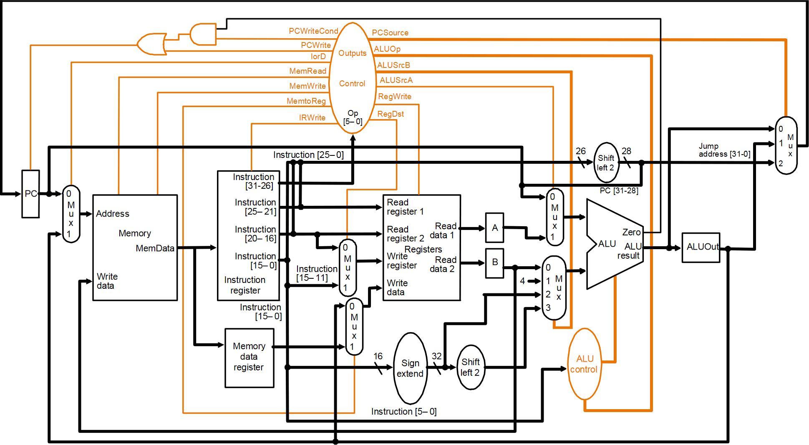

# 32-bit multi-cycle MIPS processor

This is a 32-bit implementation of a multi-cycle MIPS processor in VHDL.
In particular, the present version of the processor includes the control unit and every functional unit of the datapath (PC, register file, ALU, instruction memory, data memory, adders, MUXs, shifters, sign-extender) as well as the test bench used to check the functional correctness of the DUT.

</img>

The multi-cycle implementation allows a functional unit to be used more than once in a instruction, so that the number of functional units can be reduced.
This is a better implementation of the single-cycle version (see [32-bit single-cycle MIPS processor](https://github.com/david-palma/MIPS-32bit/tree/master/MIPS32_single_cycle)).

**NOTE**: it is possible to test the architecture defining your own program instructions using the [32-bit assembly instruction encoder for MIPS processors](https://github.com/david-palma/MIPS-32bit_encoder).
