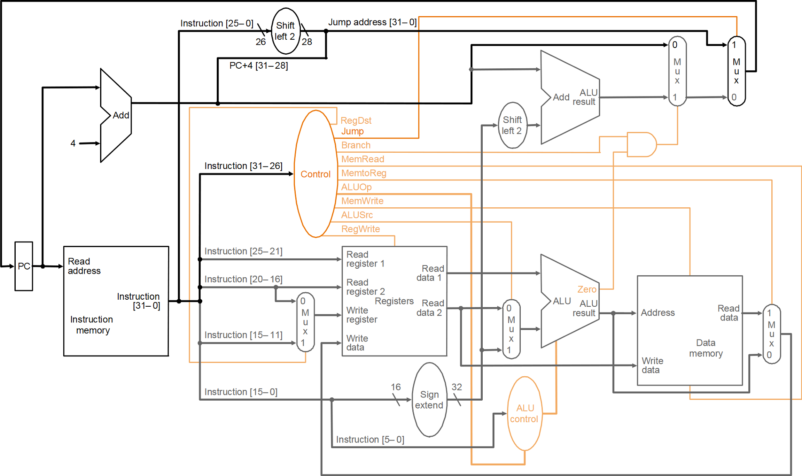

# 32-bit single-cycle MIPS processor

This is a 32-bit implementation of a single-cycle MIPS processor in VHDL.
In particular, the present version of the processor includes the control unit and every functional unit of the datapath (PC, register file, ALU, instruction memory, data memory, adders, MUXs, shifters, sign-extender) as well as the test bench used to check the functional correctness of the DUT.

</img>

In a single-cycle implementation, a clock cycle must have the same length for every instruction and therefore it is determined by the longest possible path (load word).
This is an issue that can be sidestepped using a multi-cycle implementation (see [32-bit multi-cycle MIPS processor](https://github.com/david-palma/MIPS-32bit/MIPS32_multi_cycle)).

**NOTE**: it is possible to test the architecture defining your own program instructions using the [32-bit assembly instruction encoder for MIPS processors](https://github.com/david-palma/MIPS-32bit/MIPS32_encoder).
